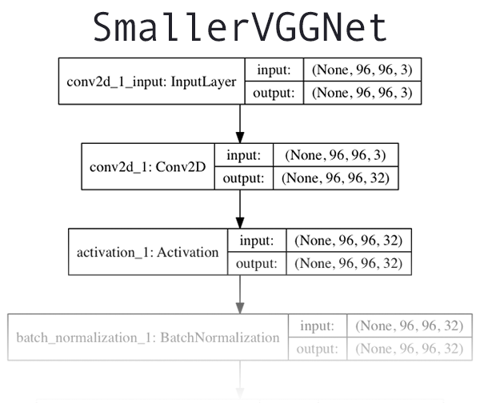

# poketmon


이 게시물은 Tensorflow 2+와 호환됩니다.  

## 딥러닝 데이터 세트


러닝 데이터 세트는 1,191개의 포켓몬 이미지로 구성되어 있습니다.  
우리의 목표는 Keras와 딥러닝을 사용하여 이러한 각 포켓 을 인식하고 분류하는 Convolutional Neural Network를 훈련하는 것입니다.

우리가 인식할 포켓몬은 다음과 같습니다.

[이상해씨][bulbasaur] (234 이미지)  
[파이리][charmander] (238 이미지)  
[꼬부기][squirtle] (223 이미지)  
[피카츄][pikachu] (234 이미지)  
[뮤츠][mewtwo] (239 이미지)  

[bulbasaur]: https://bulbapedia.bulbagarden.net/wiki/Bulbasaur_(Pok%C3%A9mon)
[charmander]: https://bulbapedia.bulbagarden.net/wiki/Charmander_(Pok%C3%A9mon)
[squirtle]: https://bulbapedia.bulbagarden.net/wiki/Squirtle_(Pok%C3%A9mon)
[pikachu]: https://bulbapedia.bulbagarden.net/wiki/Pikachu_(Pok%C3%A9mon)
[mewtwo]: https://bulbapedia.bulbagarden.net/wiki/Mewtwo_(Pok%C3%A9mon)


교육 이미지에는 다음이 혼합되어 있습니다.  
* TV 쇼 및 영화의 스틸 프레임  
* 트레이딩 카드  
* 액션 피규어  
* 장난감 및 봉제인형  
* 팬의 그림 및 예술적 렌더링  

## 1. Source Structure

├── README.md  
├── classify.py  
├── dataset  
│   ├── bulbasaur/[234개]  
│   ├── charmander/[238개]  
│   ├── mewtwo/[239개]  
│   ├── pikachu/[234개]  
│   └── squirtle/[223개]  
├── examples[6개]  
│   ├── bulbasaur_plush.png  
│   ├── charmander_counter.png  
│   ├── charmander_hidden.png  
│   ├── mewtwo_toy.png  
│   ├── pikachu_toy.png  
│   └── squirtle_plush.png  
├── lb.pickle  
├── module  
│   ├── __init__.py  
│   └── smallervggnet.py  
├── plot.png  
├── pokedex.model  
└── train.py  

이 소스구조에는 3개의 디렉토리가 있습니다.  

> dataset: 5개의 클래스가 포함되어 있으며, 각 클래스는 클래스 레이블을 쉽게 구분할 수 있도록 되어있습니다.  
> examples: CNN을 테스트하는 데 사용할 이미지가 포함되어 있습니다.  
> module: `SmallerVGGNet` model class가 포함된 폴더
	
그외 파일  

	> plot.png: train.py가 실행된 후 생성되는 train/test accuracy 및 loss plot  
	> lb.pickle: `labelBinarizer`가 직렬화된 개체파일(여기에는 클래스 이름 조회 매커니즘에 대한 클래스 인덱스가 포함)
	> pokedex.model : 직렬화된 Keras Convolutional Neural Network 모델 파일(즉, "가중치 파일")입니다.
	> train.py: Keras CNN을 훈련하고 정확도/손실을 플롯한 다음 CNN과 레이블 이진화기를 디스크에 직렬화합니다.  
	> classify.py : test script


## 2. Keras and CNN architecture  



CNN 아키텍처는 *Simonyan*과 *Zisserman*이 2014년 논문인 **Very Deep Convolutional Networks for Large Scale Image Recognition** 에서 소개한 VGGNet 네트워크의 더 작고 컴팩트한 변형입니다 .

VGGNet과 유사한 아키텍처는 다음과 같은 특징이 있습니다.

> 1. 깊이가 증가하면서 서로의 위에 쌓인 3x3 컨볼루션 레이어만 사용  
> 2. 최대 풀링으로 볼륨 크기 줄이기  
> 3. softmax 분류기 이전 네트워크 끝의 완전 연결 계층  
> 4. 시스템에 Keras가 이미 설치 및 구성되어 있다고 가정합니다. 그렇지 않은 경우 내가 함께 만든 딥 러닝 개발 환경 구성 자습서에 대한 몇 가지 링크가 있습니다.

## 3. USAGE: 

```bash
python train.py --dataset dataset --model pokedex.model --labelbin lb.pickle
```

## 4. Argument:

> "-d", "--dataset": path to input dataset  
> "-m", "--model": path to output model  
> "-l", "--labelbin": path to output label binarizer  
> "-p", "--plot", default="plot.png": path to output accuracy/loss plot  


## 5. Source:

> poketmon/module/smallervggnet.py

```python
# import the necessary packages  
from tensorflow.keras.models import Sequential  
from tensorflow.keras.layers import BatchNormalization  
from tensorflow.keras.layers import Conv2D  
from tensorflow.keras.layers import MaxPooling2D  
from tensorflow.keras.layers import Activation  
from tensorflow.keras.layers import Flatten  
from tensorflow.keras.layers import Dropout  
from tensorflow.keras.layers import Dense  
from tensorflow.keras import backend as K  
```
먼저 모듈을 가져옵니다. 

```python
class SmallerVGGNet:  
	@staticmethod  
	def build(width, height, depth, classes):  
		# initialize the model along with the input shape to be  
		# "channels last" and the channels dimension itself  
		model = Sequential()  
		inputShape = (height, width, depth)  
		chanDim = -1  
		# if we are using "channels first", update the input shape  
		# and channels dimension  
		if K.image_data_format() == "channels_first":  
			inputShape = (depth, height, width)  
			chanDim = 1  
```

빌드 방법에는 4개의 매개변수가 필요합니다.  
  
width : 이미지 너비 치수입니다.  
height : 이미지 높이 치수입니다.  
depth : 이미지의 깊이 - 채널 수라고도 합니다.  
classes: 데이터세트의 클래스 수(모델의 마지막 레이어에 영향을 줌).   
Note: 다음과 같은 입력 이미지로 작업할 것입니다(96 x 96 x 3).


이제 모델에 레이어를 추가해 보겠습니다.  
```python
		# CONV => RELU => POOL  
		model.add(Conv2D(32, (3, 3), padding="same",  
			input_shape=inputShape))  
		model.add(Activation("relu"))  
		model.add(BatchNormalization(axis=chanDim))  
		model.add(MaxPooling2D(pool_size=(3, 3)))  
		model.add(Dropout(0.25))  
```
위는 우리의 첫 번째 `CONV = > RELU = > POOL` 블록입니다.
컨볼루션 레이어는 32개의 필터(3 × 3 kernel). 우리는 `RELU`함수를 사용하고 있습니다. 

우리의 POOL 레이어는 3 × 3 POOL 공간 차원을 빠르게 줄이기 위한 크기 96 x 96 => 32 X 32  

코드 블록에서 볼 수 있듯이 네트워크 아키텍처에서도 드롭아웃을 활용할 것입니다. Dropout은 현재 레이어 에서 다음 레이어 로 노드를 무작위로 연결 해제하여 작동합니다 . 

거기에서 (CONV => RELU ) * 2를  다른 레이어를 적용하기 전에 적용합니다.:

```python
		# (CONV => RELU) * 2 => POOL  
		model.add(Conv2D(64, (3, 3), padding="same"))  
		model.add(Activation("relu"))  
		model.add(BatchNormalization(axis=chanDim))  
		model.add(Conv2D(64, (3, 3), padding="same"))  
		model.add(Activation("relu"))  
		model.add(BatchNormalization(axis=chanDim))  
		model.add(MaxPooling2D(pool_size=(2, 2)))  
		model.add(Dropout(0.25))  
```
다음으로 필터 크기를 늘렸습니다. 과적합을 줄이기 위해 노드의 25%를 드롭아웃합니다.
그리고 마지막으로, 우리는 FC = > RELU 레이어 및 softmax 분류기를 사용합니다.:

```python
		# first (and only) set of FC => RELU layers  
		model.add(Flatten())  
		model.add(Dense(1024))  
		model.add(Activation("relu"))  
		model.add(BatchNormalization())  
		model.add(Dropout(0.5))  
		# softmax classifier  
		model.add(Dense(classes))  
		model.add(Activation("softmax"))  
		# return the constructed network architecture  
		return model  
```
완전 연결 계층은 다음과 같이 지정합니다.  
Dropout은 마지막으로 수행됩니다. 이번에는 훈련 중에 노드의 50%를 제거합니다. 일반적으로 완전히 연결된 레이어에서는 40-50%의 드롭아웃을 사용하고 이전 레이어에서는 일반적으로 10-25%의 훨씬 낮은 비율로 드롭아웃을 사용합니다.

각 클래스 레이블에 대해 예측된 확률을 반환하는 softmax 분류기로 모델을 마무리합니다.

### CNN + Keras training 스크립트 구현

이제 그 작게VGGNet 구현되면 Keras를 사용하여 Convolutional Neural Network를 훈련할 수 있습니다.

새 파일을 열고 이름을 지정하십시오. 기차.py , 필수 패키지 및 라이브러리를 가져올 위치에 다음 코드를 삽입합니다.

```python
# set the matplotlib backend so figures can be saved in the background  
import matplotlib  
matplotlib.use("Agg")  
# import the necessary packages  
from tensorflow.keras.preprocessing.image import ImageDataGenerator  
from tensorflow.keras.optimizers import Adam  
from tensorflow.keras.preprocessing.image import img_to_array  
from sklearn.preprocessing import LabelBinarizer  
from sklearn.model_selection import train_test_split  
from module import SmallerVGGNet  
import matplotlib.pyplot as plt  
from imutils import paths  
import numpy as np  
import argparse  
import random  
import pickle  
import cv2  
import os  
```

우리는 그림을 저장할 수 있도록 matplotlib 백엔드를 "Agg"를 사용합니다.
`ImageDataGenerator` 클래스는 데이터를 증식하는대 사용되며, 데이터 세트의 기존 이미지를 가져오고 무작위 변환(회전, 전단 등)을 적용하여 추가 훈련 데이터를 생성하는 데 사용됩니다. 데이터 증대는 과적합을 방지하는 데 도움이 됩니다.

이제 `Adam`옵티마이져를 사용하고 
.아담 옵티마이저, 네트워크 훈련에 사용되는 옵티마이저 방법.

1. 클래스 레이블 세트(즉, 데이터 세트에서 사람이 읽을 수 있는 클래스 레이블을 나타내는 문자열)를 입력합니다.
2. 클래스 레이블을 원-핫 인코딩된 벡터로 변환합니다.
3. Keras CNN에서 정수 클래스 레이블 예측을 가져와 사람이 읽을 수 있는 레이블로 다시 변환할 수 있습니다.


`train_test_split` 함수는 훈련 및 테스트 분할을 생성하는 데 사용됩니다. 

여기에서 명령줄 인수를 구문 분석해 보겠습니다 .

```python
# construct the argument parse and parse the arguments  
ap = argparse.ArgumentParser()  
ap.add_argument("-d", "--dataset", required=True,  
	help="path to input dataset (i.e., directory of images)")  
ap.add_argument("-m", "--model", required=True,  
	help="path to output model")  
ap.add_argument("-l", "--labelbin", required=True,  
	help="path to output label binarizer")  
ap.add_argument("-p", "--plot", type=str, default="plot.png",  
	help="path to output accuracy/loss plot")  
args = vars(ap.parse_args())
```
훈련 스크립트의 경우 세 가지 필수 명령줄 인수를 제공해야 합니다 .

--dataset : 입력 데이터 세트의 경로입니다. 각 하위 디렉토리에는 ~250개의 포켓몬 이미지가 있습니다. 자세한 내용은 이 게시물 상단의 프로젝트 디렉토리 구조를 참조하세요.
--model : 출력 모델에 대한 경로 — 이 교육 스크립트는 모델을 교육하고 디스크에 출력합니다.
--labelbin : 출력 레이블 binarizer의 경로 — 곧 보게 되겠지만, 데이터 세트 디렉토리 이름에서 클래스 레이블을 추출하고 레이블 binarizer를 빌드합니다.
우리는 또한 하나의 선택적 인수가 있습니다.   
--plot: 경로/파일 이름을 지정하지 않으면 plot.png 파일은 현재 작업 디렉토리에 배치됩니다.

이제 명령줄 인수를 처리했으므로 몇 가지 중요한 변수를 초기화해 보겠습니다.

```python
# initialize the number of epochs to train for, initial learning rate,  
# batch size, and image dimensions  
EPOCHS = 100  
INIT_LR = 1e-3  
BS = 32  
IMAGE_DIMS = (96, 96, 3)  
# initialize the data and labels  
data = []  
labels = []  
# grab the image paths and randomly shuffle them  
print("[INFO] loading images...")  
imagePaths = sorted(list(paths.list_images(args["dataset"])))  
random.seed(42)  
random.shuffle(imagePaths)
```

Keras CNN을 훈련할 때 사용되는 중요한 변수를 초기화합니다.

EPOCHS: 네트워크를 훈련할 총 에포크 수(즉, 네트워크가 각 훈련 예제를 "보고" 패턴을 학습하는 횟수).  
INIT_LR: 초기 학습률 - 1e-3의 값은 네트워크 훈련에 사용할 옵티마이저인 Adam 옵티마이저의 기본값입니다.  
BS(BatchSize): 훈련을 위해 이미지 배치를 네트워크에 전달할 것입니다. Epoch당 여러 배치가 있습니다. 그만큼 BS 값은 배치 크기를 제어합니다.  
IMAGE_DIMS: 여기에서 입력 이미지의 공간 차원을 제공합니다. 입력 이미지는 다음과 같아야 합니다.96 x 96 x 3(즉, RGB).  
또한 두 개의 목록을 초기화합니다. 데이터 과 라벨 사전 처리된 이미지와 레이블을 각각 보유합니다.  

그리고나서 모든 이미지 경로를 잡고 무작위로 섞습니다.  
그리고 거기에서 우리는 각각에 대해 반복할 것입니다 이미지 경로 :  
```python
# loop over the input images  
for imagePath in imagePaths:  
	# load the image, pre-process it, and store it in the data list  
	image = cv2.imread(imagePath)  
	image = cv2.resize(image, (IMAGE_DIMS[1], IMAGE_DIMS[0]))  
	image = img_to_array(image)  
	data.append(image)  
	# extract the class label from the image path and update the  
	# labels list  
	label = imagePath.split(os.path.sep)[-2]  
	labels.append(label)  
```
`img_to_array`는 이미지를 `Keras` 호환 배열로 변환하는 함수입니다.  


```python
# scale the raw pixel intensities to the range [0, 1]  
data = np.array(data, dtype="float") / 255.0  
labels = np.array(labels)  
print("[INFO] data matrix: {:.2f}MB".format(  
	data.nbytes / (1024 * 1000.0)))  
# binarize the labels  
lb = LabelBinarizer()  
labels = lb.fit_transform(labels)  
# partition the data into training and testing splits using 80% of  
# the data for training and the remaining 20% for testing  
(trainX, testX, trainY, testY) = train_test_split(data,  
	labels, test_size=0.2, random_state=42)  
```
여기서 먼저 변환 데이터 배열을 NumPy 배열로 만든 다음 픽셀 강도를 0~1범위로 조정합니다. 그런 다음 scikit-learn을 사용하여 LabelBinarizer를 사용하여 레이블을 이진화합니다.  

딥러닝 또는 해당 문제에 대한 모든 머신 러닝의 경우 일반적인 관행은 훈련과 테스트를 분리하는 것입니다. 
다음으로 이미지 데이터 증식을 사용합니다.  

```python
# construct the image generator for data augmentation  
aug = ImageDataGenerator(rotation_range=25, width_shift_range=0.1,  
	height_shift_range=0.1, shear_range=0.2, zoom_range=0.2,  
	horizontal_flip=True, fill_mode="nearest")  
```

제한된 양의 데이터 포인트(클래스당 이미지 250개 미만)로 작업하고 있기 때문에 훈련 과정에서 데이터 증식을 사용하여 모델에 훈련할 더 많은 이미지(기존 이미지 기반)를 제공할 수 있습니다.  

Data Augmentation은 모든 딥러닝 실무자의 도구 상자에 있어야 하는 도구입니다. 
여기에서 모델을 컴파일하고 교육을 시작하겠습니다.  

```python
# initialize the model  
print("[INFO] compiling model...")  
model = SmallerVGGNet.build(width=IMAGE_DIMS[1], height=IMAGE_DIMS[0],  
	depth=IMAGE_DIMS[2], classes=len(lb.classes_))  
opt = Adam(lr=INIT_LR, decay=INIT_LR / EPOCHS)  
model.compile(loss="categorical_crossentropy", optimizer=opt,  
	metrics=["accuracy"])  
# train the network  
print("[INFO] training network...")  
H = model.fit(  
	x=aug.flow(trainX, trainY, batch_size=BS),  
	validation_data=(testX, testY),  
	steps_per_epoch=len(trainX) // BS,  
	epochs=EPOCHS, verbose=1)  
```

두 클래스의 경우에만 이진 교차 엔트로피를 손실로 사용해야 합니다.
CPU 또는 GPU를 사용하여 훈련하는지 여부에 따라 시간이 걸릴 수 있습니다.  

Keras CNN이 훈련을 마치면 훈련/테스트 세트 외부의 이미지에서 네트워크를 테스트할 때 디스크에서 로드해야 하므로 모델과 레이블 이진화기를 모두 저장하려고 합니다. :  

```python
# save the model to disk  
print("[INFO] serializing network...")  
model.save(args["model"], save_format="h5")  
# save the label binarizer to disk  
print("[INFO] serializing label binarizer...")  
f = open(args["labelbin"], "wb")  
f.write(pickle.dumps(lb))  
f.close()  
```

`classify.py`는 나중에 쉽게 사용할 수 있도록 모델과 레이블 이진화 도구를 직렬화합니다.

레이블 이진화 파일에는 사람이 읽을 수 있는 클래스 레이블 사전에 대한 클래스 색인이 포함되어 있습니다. 이 객체를 사용하면 Keras CNN을 사용하려는 스크립트에서 클래스 레이블을 하드코딩할 필요가 없습니다.  

마지막으로 훈련 및 손실 정확도를 플롯할 수 있습니다.  


```python
# plot the training loss and accuracy  
plt.style.use("ggplot")  
plt.figure()  
N = EPOCHS  
plt.plot(np.arange(0, N), H.history["loss"], label="train_loss")  
plt.plot(np.arange(0, N), H.history["val_loss"], label="val_loss")  
plt.plot(np.arange(0, N), H.history["accuracy"], label="train_acc")  
plt.plot(np.arange(0, N), H.history["val_accuracy"], label="val_acc")  
plt.title("Training Loss and Accuracy")  
plt.xlabel("Epoch #")  
plt.ylabel("Loss/Accuracy")  
plt.legend(loc="upper left")  
plt.savefig(args["plot"])  
```

### Keras로 CNN 훈련

이제 Pokedex CNN을 훈련할 준비가 되었습니다.

```bash
$ python train.py --dataset dataset --model pokedex.model --labelbin lb.pickle  
Using TensorFlow backend.  
[INFO] loading images...  
[INFO] data matrix: 252.07MB  
[INFO] compiling model...  
[INFO] training network...  
Train for 29 steps, validate on 234 samples  
Epoch 1/100  
29/29 [==============================] - 7s 237ms/step - loss: 1.4218 - accuracy: 0.6271 - val_loss: 1.9534 - val_accuracy: 0.2436  
Epoch 2/100  
29/29 [==============================] - 6s 208ms/step - loss: 0.7470 - accuracy: 0.7703 - val_loss: 2.7184 - val_accuracy: 0.3632  
Epoch 3/100  
29/29 [==============================] - 6s 207ms/step - loss: 0.5928 - accuracy: 0.8080 - val_loss: 2.8207 - val_accuracy: 0.2436  
...  
29/29 [==============================] - 6s 208ms/step - loss: 0.2108 - accuracy: 0.9423 - val_loss: 1.7813 - val_accuracy: 0.8248  
Epoch 98/100  
29/29 [==============================] - 6s 208ms/step - loss: 0.1170 - accuracy: 0.9645 - val_loss: 2.2405 - val_accuracy: 0.7265  
Epoch 99/100  
29/29 [==============================] - 6s 208ms/step - loss: 0.0961 - accuracy: 0.9689 - val_loss: 1.2761 - val_accuracy: 0.8333  
Epoch 100/100  
29/29 [==============================] - 6s 207ms/step - loss: 0.0449 - accuracy: 0.9834 - val_loss: 1.1710 - val_accuracy: 0.8291  
[INFO] serializing network...  
[INFO] serializing label binarizer...  

```
훈련 스크립트의 출력을 보면 Keras CNN이 다음을 얻었음을 알 수 있습니다.

훈련 세트 에서 98.34% 분류 정확도
그리고 82.91 %의 상의 정확도 테스트 세트
훈련 손실/정확도 플롯은 다음과 같습니다.


### Creating our CNN and Keras testing script

CNN이 훈련되었으므로 훈련 또는 검증/테스트 세트의 일부가 아닌 이미지를 분류하는 스크립트를 구현해야 합니다. 새 파일을 열고 이름을 지정하십시오.classify.py , 다음 코드를 삽입합니다.

```python
# import the necessary packages  
from tensorflow.keras.preprocessing.image import img_to_array  
from tensorflow.keras.models import load_model  
import numpy as np  
import argparse  
import imutils  
import pickle  
import cv2  
import os  
```

먼저 필요한 패키지를 가져옵니다
여기에서 명령줄 인수를 구문 분석해 보겠습니다.

```python
# construct the argument parser and parse the arguments  
ap = argparse.ArgumentParser()  
ap.add_argument("-m", "--model", required=True,  
	help="path to trained model model")  
ap.add_argument("-l", "--labelbin", required=True,  
	help="path to label binarizer")  
ap.add_argument("-i", "--image", required=True,  
	help="path to input image")  
args = vars(ap.parse_args())  
```

구문 분석해야 하는 세 가지 필수 명령줄 인수 가 있습니다.

--model : 방금 훈련한 모델의 경로입니다.  
--label-bin : 레이블 이진화 파일의 경로입니다.  
--image : 입력 이미지 파일 경로입니다.  


다음으로 이미지를 로드하고 사전 처리합니다.

```python
# load the image  
image = cv2.imread(args["image"])  
output = image.copy()  
 
# pre-process the image for classification  
image = cv2.resize(image, (96, 96))  
image = image.astype("float") / 255.0  
image = img_to_array(image)  
image = np.expand_dims(image, axis=0)  
```


```python
# load the trained convolutional neural network and the label  
# binarizer  
print("[INFO] loading network...")  
model = load_model(args["model"])  
lb = pickle.loads(open(args["labelbin"], "rb").read())  
# classify the input image  
print("[INFO] classifying image...")  
proba = model.predict(image)[0]  
idx = np.argmax(proba)  
label = lb.classes_[idx]  
```

나머지 코드 블록은 표시용입니다.  


```python
# we'll mark our prediction as "correct" of the input image filename  
# contains the predicted label text (obviously this makes the  
# assumption that you have named your testing image files this way)  
filename = args["image"][args["image"].rfind(os.path.sep) + 1:]  
correct = "correct" if filename.rfind(label) != -1 else "incorrect"  
# build the label and draw the label on the image  
label = "{}: {:.2f}% ({})".format(label, proba[idx] * 100, correct)  
output = imutils.resize(output, width=400)  
cv2.putText(output, label, (10, 25),  cv2.FONT_HERSHEY_SIMPLEX,  
	0.7, (0, 255, 0), 2)  
# show the output image  
print("[INFO] {}".format(label))  
cv2.imshow("Output", output)  
cv2.waitKey(0)  
```

### CNN과 Keras로 이미지 분류하기
이제 실행할 준비가 되었습니다. classify.py 스크립트!


```bash
$ python classify.py --model pokedex.model --labelbin lb.pickle \  
	--image examples/charmander_counter.png  
Using TensorFlow backend.  
[INFO] loading network...  
[INFO] classifying image...  
[INFO] charmander: 85.42% (correct)  
```

image 파이리


```bash
$ python classify.py --model pokedex.model --labelbin lb.pickle \  
	--image examples/bulbasaur_plush.png  
Using TensorFlow backend.  
[INFO] loading network...  
[INFO] classifying image...  
[INFO] bulbasaur: 99.61% (correct)  
```

```bash
$ python classify.py --model pokedex.model --labelbin lb.pickle \  
	--image examples/mewtwo_toy.png  
Using TensorFlow backend.  
[INFO] loading network...   
[INFO] classifying image...  
[INFO] mewtwo: 81.52% (correct)  
```

```bash
$ python classify.py --model pokedex.model --labelbin lb.pickle \  
	--image examples/pikachu_toy.png  
Using TensorFlow backend.  
[INFO] loading network...  
[INFO] classifying image...  
[INFO] pikachu: 100.00% (correct)  
```

```bash
$ python classify.py --model pokedex.model --labelbin lb.pickle \  
	--image examples/squirtle_plush.png  
Using TensorFlow backend.  
[INFO] loading network...  
[INFO] classifying image...  
[INFO] squirtle: 99.96% (correct)  
```

```bash
$ python classify.py --model pokedex.model --labelbin lb.pickle \  
	--image examples/charmander_hidden.png  
Using TensorFlow backend.  
[INFO] loading network...  
[INFO] classifying image...  
[INFO] charmander: 98.78% (correct)  
```

이 포켓몬들 각각은 내 새로운 Pokedex와 일치하지 않았습니다.

현재 약 807종의 포켓몬이 있습니다. 우리의 분류기는 5가지 다른 포켓몬에 대해서만 훈련되었습니다(간단함을 위해).

더 큰 Pokedex에 대해 더 많은 포켓몬을 인식하도록 분류기를 훈련시키려면 각 클래스에 대한 추가 훈련 이미지가 필요합니다 . 이상적으로 목표는 인식하려는 클래스당 500-1,000개의 이미지 가 있어야 합니다 .

훈련 이미지를 얻으려면 Microsoft Bing의 이미지 검색 API 이상 을 보지 않는 것이 좋습니다 . 이 API는 내가 공유 한 이전 Google 이미지 검색 해킹 보다 사용하기가 더 쉽습니다 (하지만 그것도 작동합니다).

이 모델의 한계
이 모델의 주요 제한 사항 중 하나는 적은 양의 훈련 데이터입니다. 다양한 이미지로 테스트했는데 분류가 잘못된 경우가 있었습니다. 이런 일이 발생했을 때 입력 이미지 + 네트워크를 더 자세히 조사한 결과 이미지에서 가장 지배적인 색상이 분류에 극적으로 영향을 미친다는 것을 발견했습니다.

예를 들어 이미지에 많은 빨간색과 주황색이 있으면 레이블로 "Charmander"가 반환될 수  있습니다. 마찬가지로 이미지에 노란색이 많으면 일반적으로  "Pikachu" 레이블이 생성됩니다.

이것은 부분적으로 우리의 입력 데이터 때문입니다. 포켓몬은 분명히 가상이므로 실제 "실제" 이미지가 없습니다(액션 피규어 및 장난감 봉제인형 제외).

우리 이미지의 대부분은 팬 일러스트레이션이나 영화/TV 쇼의 스틸에서 가져왔습니다. 또한 각 클래스에 대해 제한된 양의 데이터만 가지고 있었습니다(~225-250개의 이미지).

이상적으로는 Convolutional Neural Network를 훈련할 때 클래스당 최소 500-1,000개의 이미지가 있어야 합니다. 자신의 데이터로 작업할 때 이 점을 염두에 두십시오.
